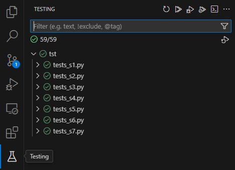

# ALG-Practicas

> [!Important]
> Los `imports` de los test han sido modificados por mí para poder ejecutarlos según la estructura del proyecto.
> Todos los tests han sido hechos por el profesorado de la UBU y, actualmente, mantenidos por [José Luis Garrido](https://www.linkedin.com/in/joseluisgarrido/)

>[!Important]
> Instalar los requisitos necesarios desde el fichero `requirements.txt`.

Prácticas de la asignatura Algoritmia en la UBU 2024/2025. Desde S1 a S7.

## Índice

1. [Introducción](#introducción)
2. [Descripción](#descripción)
3. [Cómo ejecutar los tests](#cómo-ejecutar-los-tests)
4. [Contribuir](#contribuir)
5. [Licencia](#licencia)

## Introducción

Aquí están resueltos todos los ejercicios de las prácticas de Algoritmia.

## Descripción

- Todas las funciones y métodos los he modificado para añadir a cada parámetro y comentario de función más información sobre lo que hace y lo que devuelve.
- Las funciones y métodos importantes tienen en su comentario de función su complejidad algorítmica.
- Para algunas funciones y métodos importantes he guardado la versión original del profesor. Puedes distinguirlas por la terminación del nombre de la función o método con `_profesor`.

## Cómo ejecutar los tests

Para ejecutar los tests, Tienes dos opciones:

1. Instalar los requisitos necesarios desde el fichero `requirements.txt`.

```bash
pip install -r requirements.txt
```

2. Ejecutar el siguiente comando en la terminal:

```bash
python -m unittest discover -s .\tst\
```

3. Con VS Code, puedes ir al apartado de `Testing` y ejecutar los tests desde ahí.



## Contribuir

Si quieres contribuir a este repositorio, puedes hacer una pull request con tus cambios.

## Licencia

Este repositorio está bajo la licencia MIT. Puedes ver más información en el archivo [LICENSE](/LICENSE).
